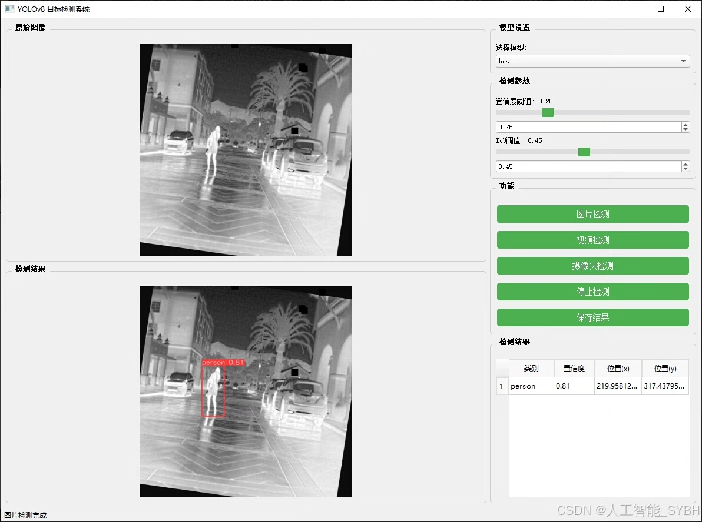
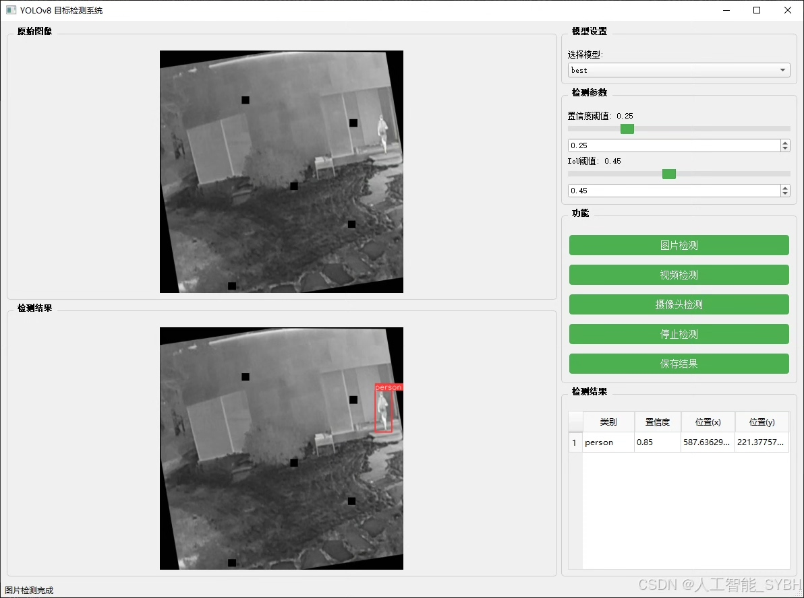
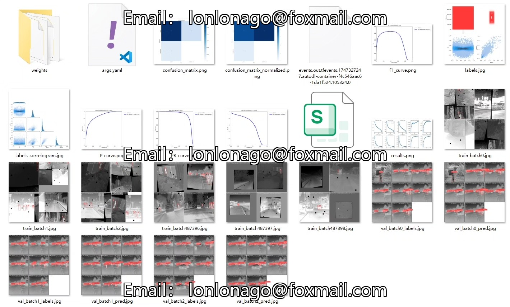
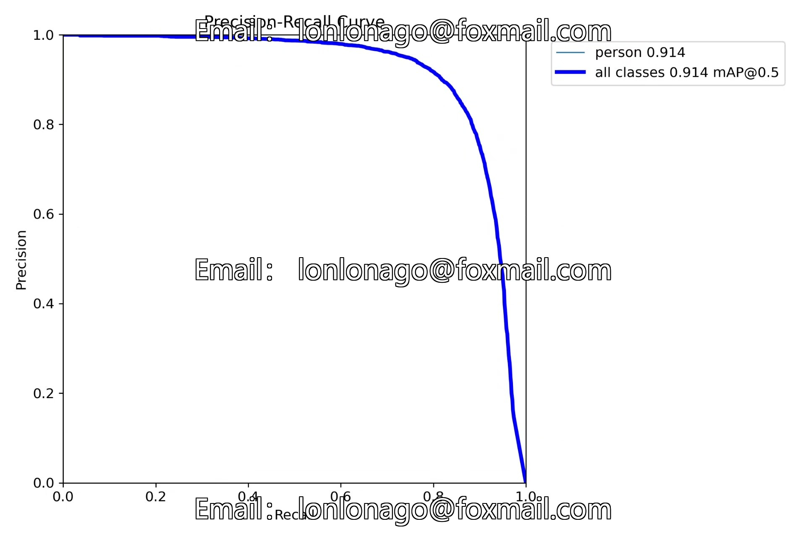
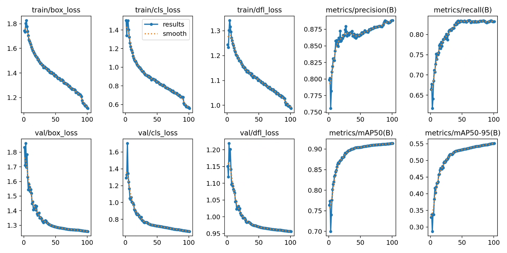
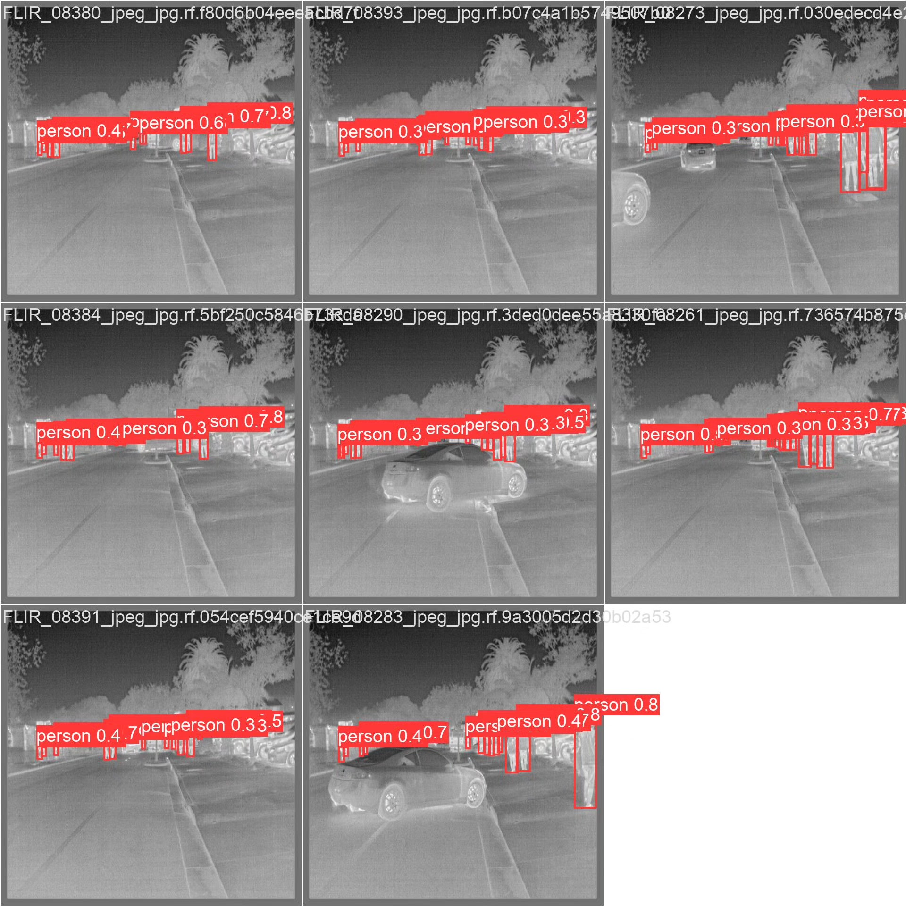
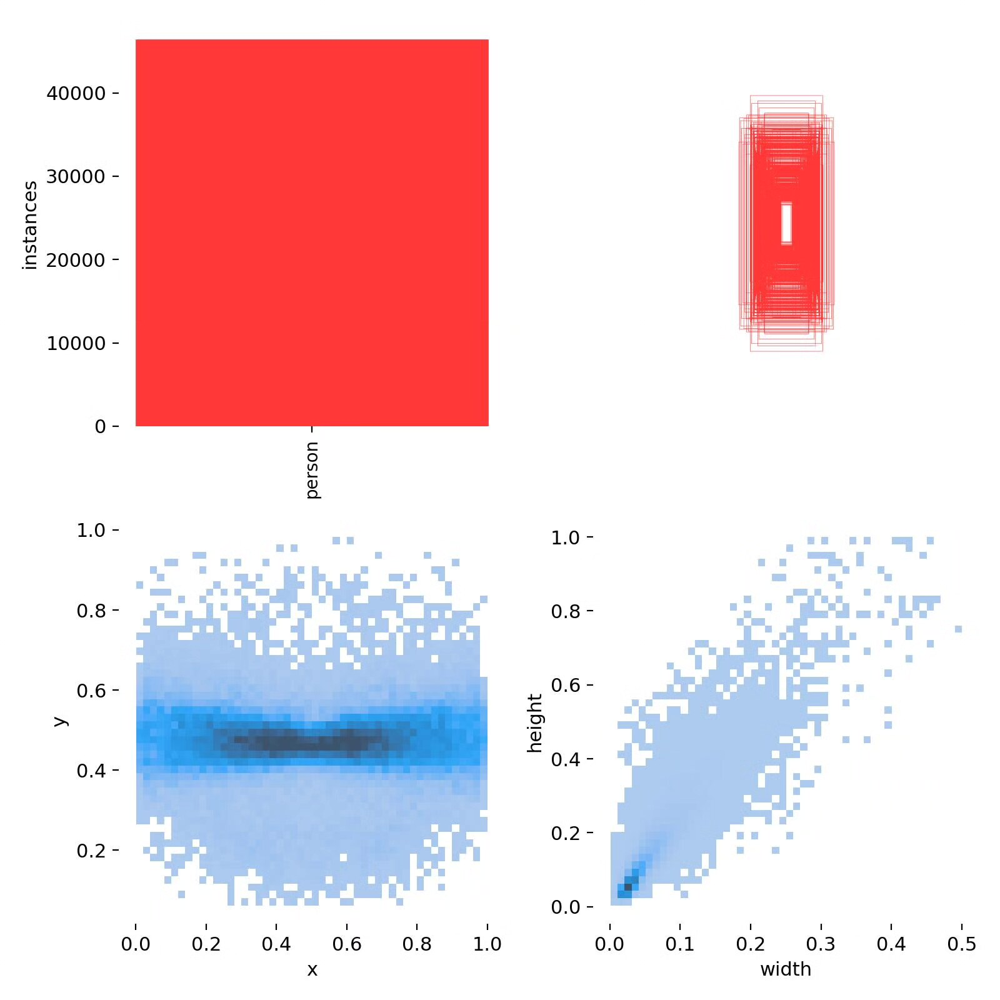
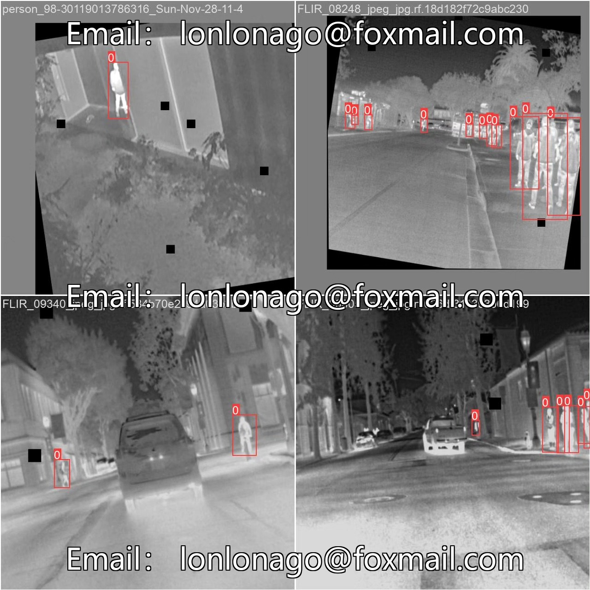

# Based on deep learning YOLOv8 for thermal imaging personnel detection system (YOLOv8+)

## Body

Based on the advanced YOLOv8 object detection algorithm, this project has developed an efficient thermal imaging personnel detection system. The system uses thermal imaging technology as the data collection method, specifically optimized for personnel detection tasks, containing only one detection category ('person'). The project has constructed a large-scale dataset, including 21,422 training images, 3,061 validation images, and 1,531 test images, totaling 26,014 thermal imaging samples. This system can reliably detect personnel under various lighting conditions, which has important practical application value. Through the combination of deep learning technology and thermal imaging sensors, this system breaks through the limitations of traditional visual detection under low lighting conditions, providing innovative solutions for applications in security monitoring, night rescue, military applications, and other fields.

The company's products have obtained YOLO official commercial license certification.

We provide after-sales service.

After payment, we will provide WeChat ID to answer questions at any time.

Environmental configuration: We will provide a tutorial on environmental configuration, and WeChat will provide答疑.

Remote installation service: If you need remote configuration, an additional fee of 69 is required.
If the configuration fails, all fees will be refunded (specially for old computers, only the installation fee will be refunded).

Retraining dataset: After configuring the environment, you can train on your own computer.
If you need us to train it, just pay 69 + computing power fees (2.5 yuan/hour)

## Images

## Payment

Here is a pay link on Stripe ( https://buy.stripe.com/3cs8yP7sY87d0vu9AB ). Please contact me lonlonago@foxmail.com after funding $89, and I will send you a complete data files , thank you!

